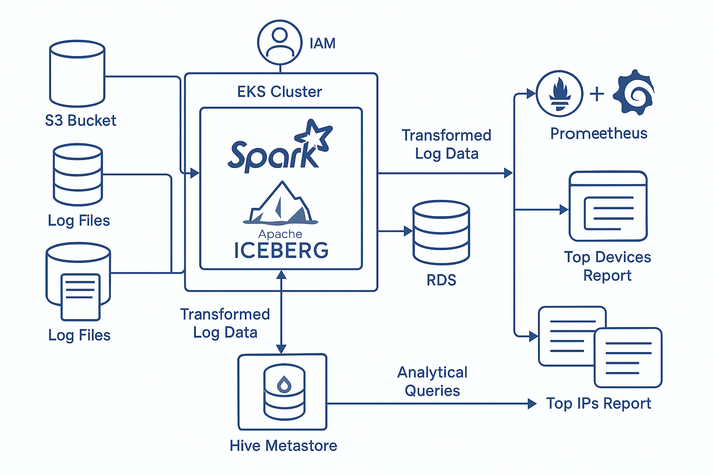

# ❄️ Iceberg Data Engineering Pipeline

This project demonstrates a complete, cloud-native data pipeline that processes raw web logs into daily and weekly analytics using **Apache Spark**, **Apache Iceberg**, **Amazon S3**, **PostgreSQL**, **Terraform**, and **Amazon EKS**. It also integrates **Prometheus** and **Grafana** for cluster and job monitoring.

---

## 📐 Architecture



**Components:**
- Raw web server logs stored in Amazon S3.
- Spark jobs on Amazon EKS transform logs and write to Iceberg tables.
- Hive Metastore metadata stored in Amazon RDS (PostgreSQL).
- Daily and weekly aggregations using Spark SQL.
- Monitoring via Prometheus + Grafana.

---

## 🛠️ Tech Stack

- **Infrastructure**: Terraform, Amazon EKS, Amazon RDS (PostgreSQL), S3
- **Data Processing**: Apache Spark 3.5.1, Apache Iceberg
- **Query Engine**: Spark SQL
- **Metadata Store**: Hive Metastore (backed by PostgreSQL RDS)
- **Monitoring**: Prometheus, Grafana
- **Scripting**: Python, Bash

---

## 📁 Folder Structure

```
iceberg-data-pipeline/
├── terraform/
│   ├── eks/                  # EKS cluster setup
│   ├── iam/                  # IAM Permissions
│   ├── rds/postgresql        # RDS PostgreSQL setup
│   └── hive-metastore/       # Helm charts to deploy Hive 
│   └── spark/                # Spark Setup
├── spark-jobs/
│   └── transform_logs.py     # ETL job using PySpark
├── sql/
│   ├── daily_top_ips.sql
│   └── weekly_top_devices.sql
├── scripts/
│   ├── deploy.sh             # Infrastructure deployment helper
│   └── run_jobs.sh           # Submit Spark jobs
├── diagrams/
│   └── architecture.png
└── README.md
```

---

## 🚀 Setup Instructions

### 1. Prerequisites

Ensure you have the following installed:

- AWS CLI configured with necessary IAM permissions
- Terraform (v1.3+)
- Helm
- kubectl
- Docker (for building Spark image if needed)
- Python 3.9+
- Spark 3.5+ with Iceberg support
- Access to an S3 bucket

---

### 2. Infrastructure Provisioning

```bash
# EKS provisioning
cd terraform/eks
terraform init
terraform apply -var-file="terraform.tfvars" -auto-approve

# Export EKS kubeconfig using AWS CLI
aws eks update-kubeconfig --region us-west-2 --name icebergs-spark-cluster

# Creating IAM Permissions for all the Services
cd ../iam
terraform init
terraform apply -var-file="terraform.tfvars" -auto-approve

# RDS PostgreSQL provisioning (MySQL provisioning also avialble here ../rds/mysql)
cd ../rds/postgresql
terraform init
terraform apply -var-file="terraform.tfvars" -auto-approve

# Hive Metastore on Kubernetes via Helm with MySQL
cd ../hive-metastore
terraform init
terraform apply -var-file="terraform.tfvars" -auto-approve

# Hive Metastore on Kubernetes via Helm with PostgreSQL
cd ../hive-metastore/hive-metastore-main/docker
# Build your own image for Hive Metastore
docker build -t hive-metastore:7.0.0 .
docker tag hive-metastore:7.0.0 rakshith16/hive-metastore:7.0.0
docker push rakshith16/hive-metastore:7.0.0
# Deploy the above image using helm in EKS
cd ../hive-metastore/
helm install hms getindata-hms/hive-metastore -f values.yaml
# To check Hive Metastore is running in EKS
kubectl get pods -n default
kubectl logs -f <pod-name> -n default

# Creating Sprak Cluster on EKS
cd ../../../spark
terraform init
terraform apply -var-file="terraform.tfvars" -auto-approve
```

---

### 3. Uploading the Log data to s3
- Using this log data available in Git hub - https://github.com/wso2-attic/product-das/blob/master/modules/samples/publishers/httpd-logs/resources/access.log

```bash
# Submit Spark job to transform raw logs
cd scripts
bash upload_logs.sh
```

---

### 4. Spark Job Execution

```bash
# Submit Spark job to transform raw logs
cd scripts
bash run_jobs_hc.sh
```

---

### 5. Query Execution

```bash
# Run daily IP summary
spark-sql -f sql/daily_top_ips.sql

# Run weekly device summary
spark-sql -f sql/weekly_top_devices.sql
```

---

### 6. Monitoring Setup
- Deploy Prometheus + Grafana
```bash
  kubectl apply -f monitoring/prometheus/ --namespace default
  kubectl apply -f monitoring/grafana/ --namespace default
```
- Access Dashboards
  - Prometheus: http://localhost:9090
  - Grafana: http://localhost:3000 (default: admin / admin)
- You can forward ports via:
```bash
  kubectl port-forward --namespace default svc/prometheus 9090:9090
  kubectl port-forward --namespace default svc/grafana 3000:3000
```
- Monitor the Spark job using Spark UI
```bash
  # Monitor the Spark job using Spark UI
  kubectl port-forward --namespace default svc/iceberg-spark-master-svc 8080:80

  # Validate the Hive Metastore
  kubectl port-forward svc/hms-hive-metastore -n default 9083:9083
```

---

## 🧾 Assumptions

- PostgreSQL is used instead of MySQL for Hive Metastore.
- Iceberg tables are stored in the specified S3 path.
- Spark image has Iceberg, Hadoop AWS, and PostgreSQL JDBC drivers.

---

## 📈 Scaling and Performance

- Adjust Spark executor and driver memory in `run_jobs.sh`.
- Scale EKS node groups via Terraform.
- See this file for metails [scaling.md](./docs/scaling.md).

---

## 👥 Contributor

- Rakshith Basavaraju
- Email - rakshith.gsds@gmail.com 